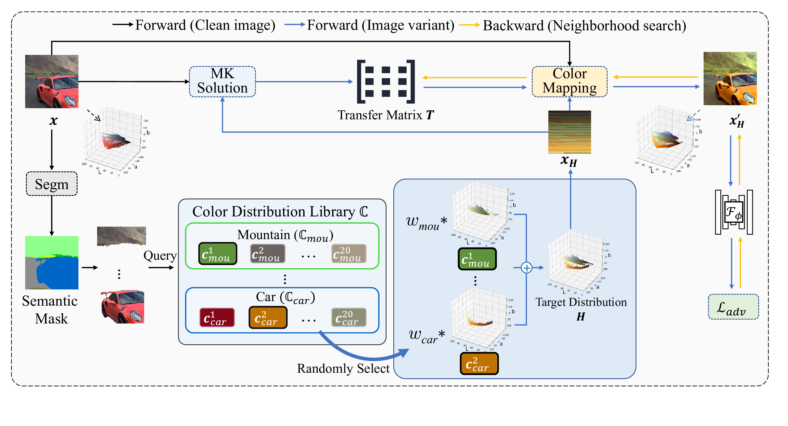
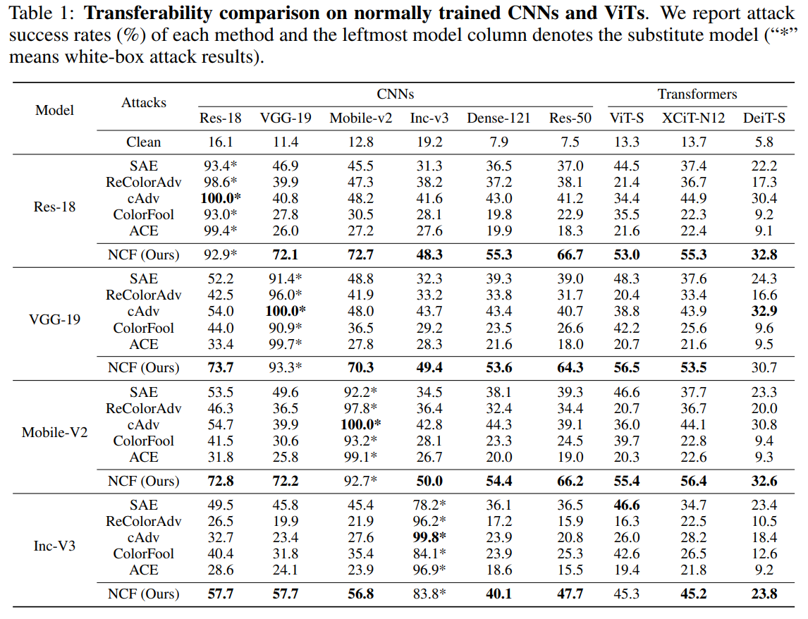

# Natural Color Fool: Towards Boosting Black-box Unrestricted Attacks (NeurIPS'22)

This repository is the official implementation of our paper [Natural Color Fool: Towards Boosting Black-box Unrestricted Attacks](https://arxiv.org/abs/2210.02041). In this paper, we propose a novel and effective **black-box unrestricted attack** Natural Color Fool (NCF) which is guided by realistic color distributions sampled from a publicly available dataset. The following is the simplified pipeline of NCF (optimizing one image variant without initialization reset):


## Quick Process

If you just want to quickly reproduce the results of our paper, run:

```bash
git clone https://github.com/VL-Group/Natural-Color-Fool.git

conda create -n ncf python==3.8
conda activate ncf

conda install pytorch==1.10.1 torchvision==0.11.2 torchaudio==0.10.1 cudatoolkit=11.1 -c pytorch -c conda-forge 
conda install matplotlib h5py scipy tqdm wandb

cd Natural-Color-Fool
wget -P ./dataset/ https://github.com/VL-Group/Natural-Color-Fool/releases/download/data/images.zip
unzip -d ./dataset/ ./dataset/images.zip

wget -P ./dataset/ https://github.com/VL-Group/Natural-Color-Fool/releases/download/data/lib_299.zip
unzip -d ./dataset/lib_299/ ./dataset/lib_299.zip

wget -P ./segm/ https://github.com/VL-Group/Natural-Color-Fool/releases/download/data/masks.npy

python main.py --gpu 0
```

## Detailed Process
### Requirements


1. create environment

```bash
conda create -n ncf python==3.8
conda activate ncf

conda install pytorch==1.10.1 torchvision==0.11.2 torchaudio==0.10.1 cudatoolkit=11.1 -c pytorch -c conda-forge 

conda install matplotlib
pip install mmcv-full==1.3.0 -f https://download.openmmlab.com/mmcv/dist/cu111/torch1.10.0/index.html

pip install mmsegmentation==0.11.0

conda install h5py scipy tqdm wandb

```


2. Datasets: 
  Download ImageNet-compatible Dataset from [Releases](https://github.com/VL-Group/Natural-Color-Fool/releases/download/data/images.zip) and put it in `./dataset/`.

3. Color Distribution Library:
  Download from [Releases](https://github.com/VL-Group/Natural-Color-Fool/releases/download/data/150_20_hist.npy) and put it in `./segm/pretrained/`.


### Segmentation

To reproduce this paper, you need to obtain masks of all images using the semantic segmentation model **Swin-T**. 
<!-- This step can be skipped if you use the masks data ([masks.npy](https://github.com/VL-Group/Natural-Color-Fool/releases/download/data/masks.npy)) we provide and put it in `./segm/`. -->


1. Configuring the semantic segmentation environment. You need to clone the [repository](https://github.com/SwinTransformer/Swin-Transformer-Semantic-Segmentation) at any location and install it. 
```bash
git clone https://github.com/SwinTransformer/Swin-Transformer-Semantic-Segmentation.git
cd Swin-Transformer-Semantic-Segmentation
pip install -e .
```
   
2. Downloading [pre-trained weights](https://github.com/SwinTransformer/storage/releases/download/v1.0.1/upernet_swin_tiny_patch4_window7_512x512.pth) (or [here](https://github.com/VL-Group/Natural-Color-Fool/releases/download/data/upernet_swin_tiny_patch4_window7_512x512.pth)) for semantic segmentation models **Swin-T** and unzip it in `./segm/pretrained/`.

3. To perform semantic segmentation of images, run:
```bash
python segm/get_segMasks.py
```

### Natural Color Fool (NCF)

1. Store the color distribution space of each image in advance:
<!-- (This step can be skipped if you use the lib data ([lib_299.zip](https://github.com/VL-Group/Natural-Color-Fool/releases/download/data/lib_299.zip)) we provide and put in `./dataset/lib_299/`.):  -->

```bash
python dataset/get_lib.py
```

2. To generate adversarial examples, run:

```bash
python main.py 
```
The results are stored in `./adv/`.
>The parameters of NCF are shown in : [config_NCF.yaml](). Test different models by modifying parameters **white_models_name** and **black_models_name** in `config_NCF.yaml`.

## Note:

The sources of pre-training weights used in this paper are as follows:

* **CNNs**: Official pre-training weights from torch.

* **Transdormers**: Pre-training weights from the [timm](https://github.com/rwightman/pytorch-image-models) library.

* **$\rm Inc\mbox{-}v3_{ens3}$, $\rm IncRes\mbox{-}v2_{ens}$**: Pre-training weights from the [tf_to_pytorch_model](https://github.com/ylhz/tf_to_pytorch_model).

* **Others**: Pre-training weights from the corresponding paper.

## Results



## Citing this work

If you find this work is useful in your research, please consider citing:

```
@inproceedings{yuan2022natural,
  author    = {Shengming Yuan
               Qilong Zhang and
               Lianli Gao and
               Yaya Chen and
               Jingkuan Song},
  title     = {Natural Color Fool: Towards Boosting Black-box Unrestricted Attacks},
  Booktitle = {NeurIPS},
  year      = {2022}
}
```
