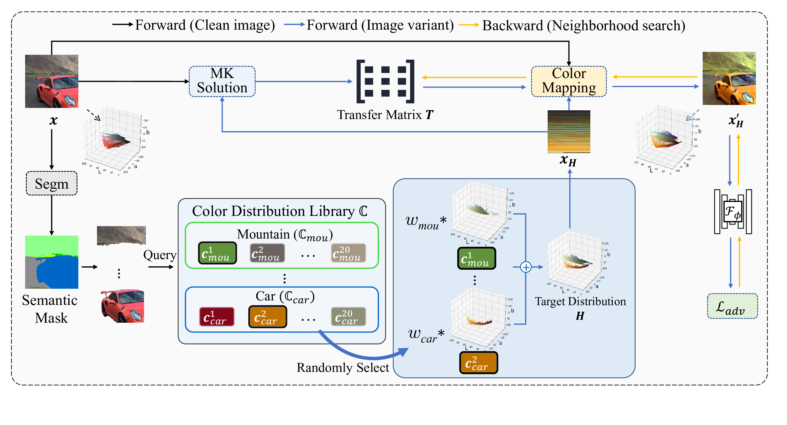
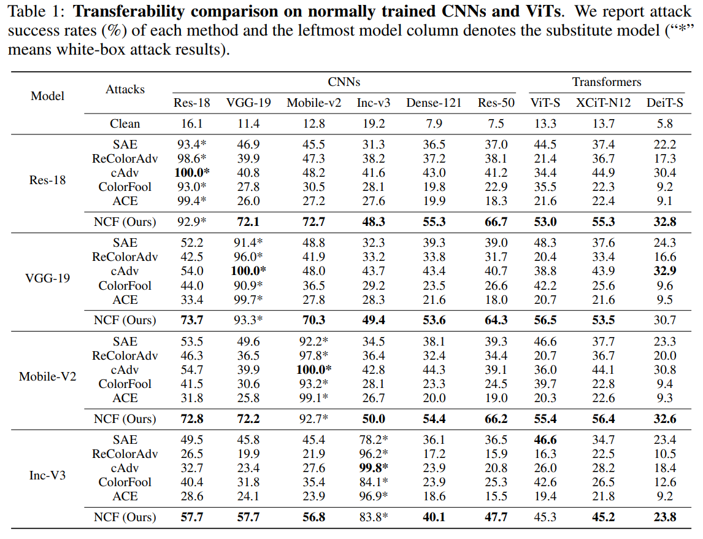

# Natural Color Fool: Towards Boosting Black-box Unrestricted Attacks (NeurIPS'22)

This repository is the official implementation of our paper [Natural Color Fool: Towards Boosting Black-box Unrestricted Attacks](). In this paper, we propose a novel and effective **black-box unrestricted attack** Natural Color Fool (NCF) which is guided by realistic color distributions sampled from a publicly available dataset. The following is the simplified pipeline of NCF (optimizing one image variant without initialization reset):


## Requirements

* PyTorch 1.10+
* Python 3.8+


* Datasets: 
  Download ImageNet-compatible Dataset from [Google Drive](https://drive.google.com/drive/folders/1EZSFzDqUnccXrNkSCPM3PPC2PU87AFEX?usp=sharing) and put it in `./dataset/`.

* Color Distribution Library:
  Download from [Google Drive](https://drive.google.com/file/d/14XTkPc-2MfDWEfpCmEix5lcsKE1RCFV6/view?usp=sharing) and put it in `./segm/pretrained/`.


## Segmentation

To reproduce this paper, you need to obtain masks of all images using the semantic segmentation model **Swin-T**.

1. Downloading [pre-trained weights](https://github.com/SwinTransformer/storage/releases/download/v1.0.1/upernet_swin_tiny_patch4_window7_512x512.pth) for semantic segmentation models **Swin-T** and put it in `segm/pretrained/`.

2. Configuring the semantic segmentation environment. Please refer to [REMEADNE](https://github.com/SwinTransformer/Swin-Transformer-Semantic-Segmentation#usage).
   
3. To perform semantic segmentation of images, run:
```bash
cd segm
python segm/get_segMasks.py
```

## Natural Color Fool (NCF)

1. Store the color distribution space of each image in advance:

```bash
python dataset/get_lib.py
```

2. To generate adversarial examples, run:

```bash
python main.py 
```
The results are stored in `./adv/`.
>The parameters of NCF are shown in : [config_NCF.yaml](). Test different models by modifying parameters **white_models_name** and **black_models_name** in `config_NCF.yaml`.

## Results



## Citing this work

If you find this work is useful in your research, please consider citing:

```
@inproceedings{yuan2022natural,
  author    = {Shengming Yuan
               Qilong Zhang and
               Lianli Gao and
               Yaya Chen and
               Jingkuan Song},
  title     = {Natural Color Fool: Towards Boosting Black-box Unrestricted Attacks},
  Booktitle = {NeurIPS},
  year      = {2022}
}
```